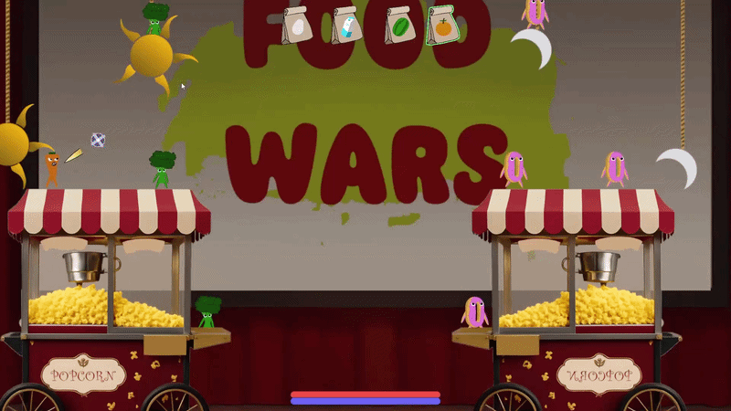
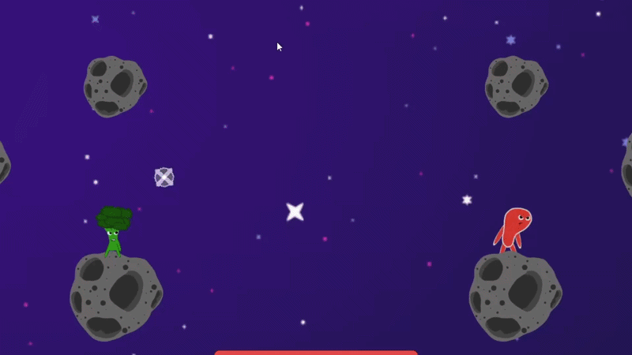

# Food Battle!

Online 2-player turn-based artillery game — you and your opponent take turns picking a weapon and lobbing it across a 2D battlefield, adjusting angle and shot power to hit each other. Built in Unity with Photon Fusion 2 (Host mode).

## Features

- 2-player online multiplayer via Photon Fusion 2 (Host / Shared authority).
- 3 maps with varying terrain and hazards.
- Multiple food-themed weapons, each with its own behavior.
- Weapons with adjustable timers (e.g. the milk carton lets you set its fuse before throwing).

## Controls

- **Mouse wheel** — cycle weapons
- **Hold left click** — charge shot power
- **Release left click** — throw
- **Scroll (on timed weapons)** — adjust explosion timer before throwing

## Design patterns used

- **MVC (Model-View-Controller)** — every entity extends `Base`, `BaseModel`, `BaseView`, `BaseController` to keep network state, visuals, and input logic separate.
- **Flyweight** — shared read-only data (weapon presets, animation controllers, game variables) referenced by many instances instead of duplicated per object.
- **Event Manager** — decoupled communication between turn flow, HUD, and gameplay via a central event bus.
- **Turn Manager** — authoritative turn cycle synced across the network.

## Structure

`Assets/`

| Folder | |
|---|---|
| `Scripts/Bases/` | MVC base classes shared by all entities. |
| `Scripts/Flyweights/` | Shared weapon / animation / variable presets. |
| `Scripts/Manager/` | Turn manager, event manager, match flow. |
| `Scripts/Player/` | Player character logic. |
| `Scripts/Lobby/` | Room creation and matchmaking. |
| `Scripts/HUD/` | In-match UI. |
| `Scripts/Objetcs/` | Weapons and in-scene interactive objects. |
| `Scripts/Redes P2/` | Network-specific glue. |
| `Photon/` | Photon Fusion 2 SDK. |
| `ParrelSync/` | Editor multi-instance testing tool. |

## Requirements

- Unity 2022.3.5f1
- Photon Fusion 2 (SDK included; needs your own App ID — free tier works)

## Run

Open `Assets/Scenes/Menu.unity` and hit Play. For local 2-player testing, use ParrelSync (Menu → ParrelSync → Clones Manager) to spin up a second Unity instance.

## Credits

- **Code:** Franco
